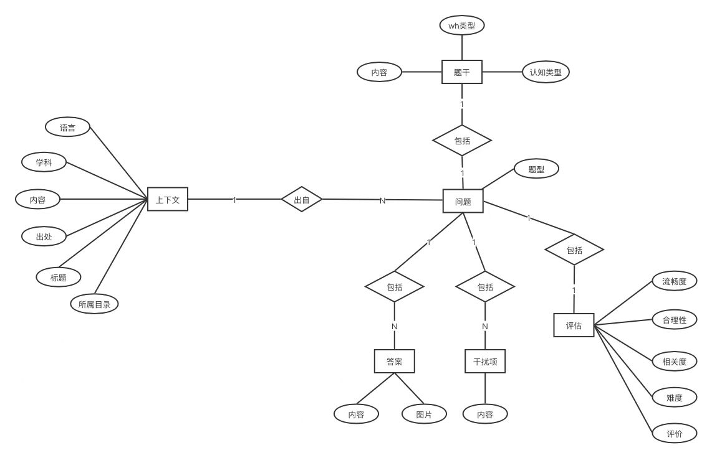
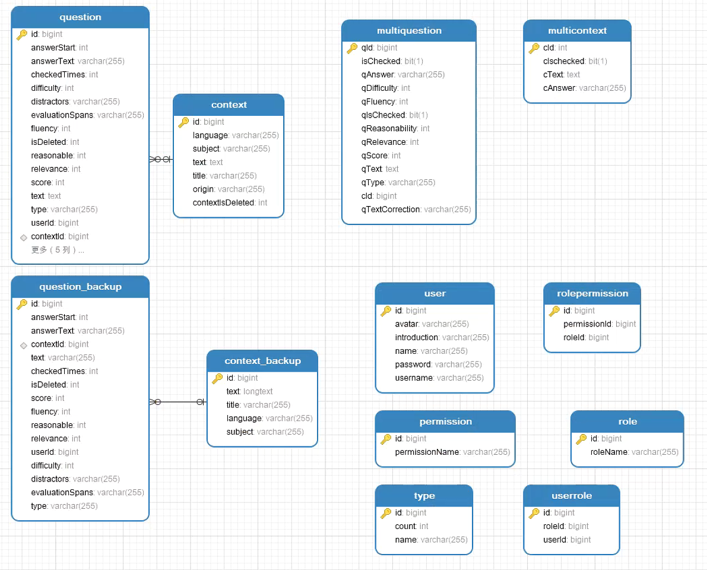
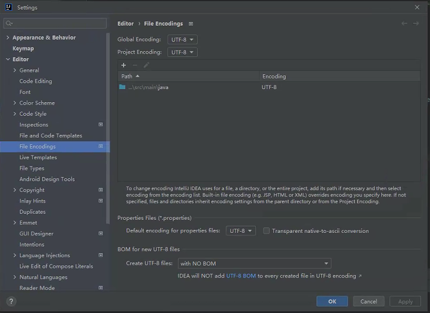
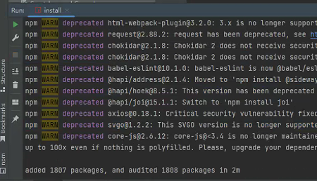

问题生成与标注系统概述

### 前后端分离的体系架构

### 后端关系数据库设计，E-R图，实现图

ER图

实现图

使用NaviCat，类似于Workbench和mysqlPHPAdmin。相比Toad，PowerDesigner这些Navicat更简单。
选择多张表，右键，选择逆向工程

### 调试后端，使用IDEA
- 问题1：为什么用redis
- 问题2：前端+后端是否就是若依系统？

https://gitee.com/zzmqaq/qgsystem.git

从git库中clone代码，发现很多包无法下载。
为IDEA构建独立Maven程序，发现好多配置，配置完成后还是有很多错误。
使用IDEA集成的Maven，发现很多错误，可能是有下载问题。

解决方法：增加版本号
<artifactId>spring-boot-maven-plugin</artifactId>
<version>2.5.4</version>

设置工程的编码：全局编码，项目编码，资源文件编码

### 调试前端，使用WebStorm

git clone https://github.com/zhang-ke-cell/QGSystem-Vue-ZK

基于https://github.com/PanJiaChen/vue-admin-template 开发。
原因：mit授权，带简单后台开发文档，轻量级

打开README.md，单击npm install左侧的绿色箭头，安装依赖。
发现大量deprecated，为什么？

"C:\Program Files\nodejs\npm.cmd" install
npm WARN EBADENGINE Unsupported engine {
npm WARN EBADENGINE   package: '@achrinza/node-ipc@9.2.2',
npm WARN EBADENGINE   required: { node: '8 || 10 || 12 || 14 || 16 || 17' },
npm WARN EBADENGINE   current: { node: 'v18.12.1', npm: '8.19.2' }
npm WARN EBADENGINE }

运行：npm run dev，报错
digital envelope routines::unsupported

百度后发现：node.js V17版本中最近发布的OpenSSL3.0, 而OpenSSL3.0对允许算法和密钥大小增加了严格的限制，可能会对生态系统造成一些影响。故此以前的项目在升级 nodejs 版本后会报错。

修改package.json，在相关构建命令之前加入set NODE_OPTIONS=–openssl-legacy-provider

"scripts": {
"serve": "SET NODE_OPTIONS=--openssl-legacy-provider && vue-cli-service serve",
"build": "SET NODE_OPTIONS=--openssl-legacy-provider && vue-cli-service build"
},

发现登录界面，使用public发现无法登录。修改vue.config.js的IP地址后可以访问。
使用新的用户名登录。
